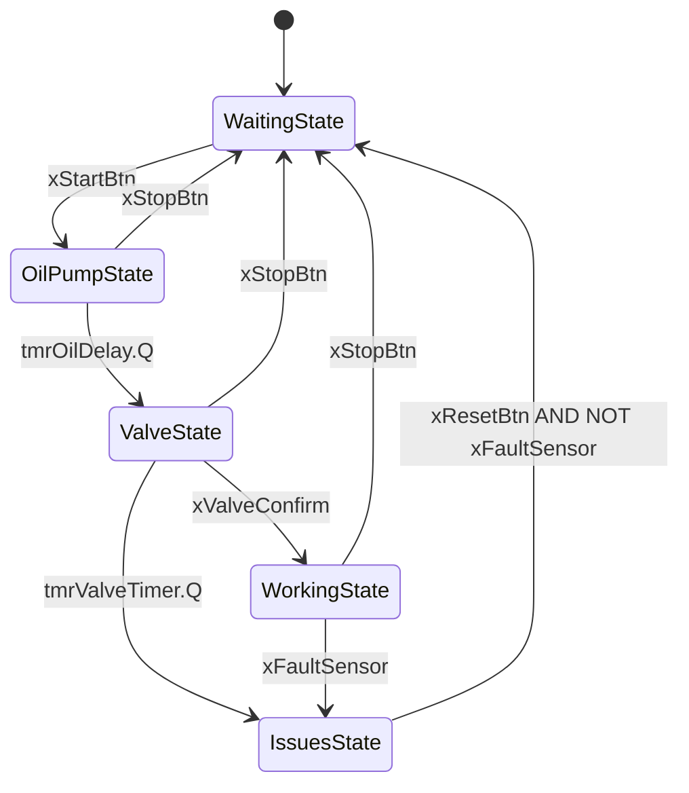

# **PLC-Motor-Startup-Sequence**
Automat stanów (state machine) sterujący sekwencją rozruchową silnika przemysłowego, napisany w języku Structured Text (ST) w środowisku CODESYS. Projekt symuluje realną logikę bezpiecznego uruchamiania maszyny: pompa oleju → zawór paliwa → praca, z obsługą awarii i wizualizacją HMI.

## **Dlaczego kolejność ma znaczenie**
To nie jest przypadkowa sekwencja - odzwierciedla realną logikę bezpieczeństwa silników przemysłowych: najpierw ustawić smarowanie silnika, by zapobiec awarii, a następnie wpuścić paliwo. Uruchomienie silnika bez ustalonego ciśnienia oleju grozi zatarciem. Timer 5s w stanie pompy oleju zapobiega temu symulując czas ustalenia smarowania.

## **Diagram stanów**

