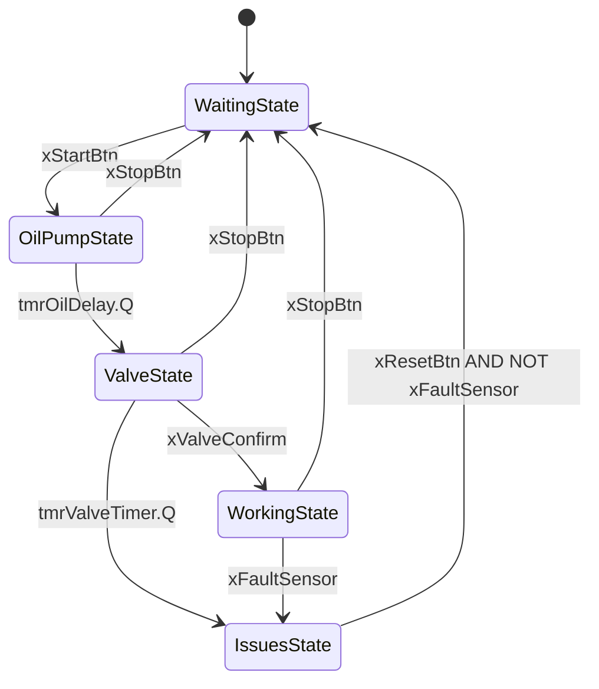

# **PLC-Motor-Startup-Sequence**
Automat stanów (state machine) sterujący sekwencją rozruchową silnika przemysłowego, napisany w języku Structured Text (ST) w środowisku CODESYS. Projekt symuluje realną logikę bezpiecznego uruchamiania maszyny: pompa oleju, zawór paliwa, prac. Z obsługą awarii i wizualizacją HMI.

## **Dlaczego kolejność ma znaczenie**
To nie jest przypadkowa sekwencja, odzwierciedla realną logikę bezpieczeństwa silników przemysłowych: najpierw ustawić smarowanie silnika, by zapobiec awarii, a następnie wpuścić paliwo. Uruchomienie silnika bez ustalonego ciśnienia oleju grozi zatarciem. Timer 5s w stanie pompy oleju zapobiega temu symulując czas ustalenia smarowania.

## **Diagram stanów**

## **Stany**
### Stany

| Stan | Opis | Aktywne wyjścia |
| :--- | :--- | :--- |
| `WaitingState` | Oczekiwanie na start | — |
| `OilPumpState` | Uruchomienie pompy oleju, timer 5s | `xPumpOn` |
| `ValveState` | Otwarcie zaworu paliwa, oczekiwanie na potwierdzenie (timeout 30s) | `xValveOpen` |
| `WorkingState` | Silnik pracuje | `xMotorRun` |
| `IssuesState` | Stan awaryjny — wszystko wyłączone | — |

## **Wejścia/Wyjścia(I/O)**

| Zmienna | Typ | Opis |
| :--- | :--- | :--- |
| `xStartBtn` | BOOL (impuls) | Uruchomienie sekwencji |
| `xStopBtn` | BOOL (impuls) | Zatrzymanie, powrót do oczekiwania |
| `xFaultSensor` | BOOL | Sygnał awarii z czujnika |
| `xResetBtn` | BOOL (impuls) | Kasowanie awarii (działa tylko gdy `xFaultSensor` = FALSE) |
| `xValveConfirm` | BOOL | Potwierdzenie otwarcia zaworu |
| `xPumpOn` | BOOL (wyjście) | Sterowanie pompą oleju |
| `xValveOpen` | BOOL (wyjście) | Sterowanie zaworem paliwa |
| `xMotorRun` | BOOL (wyjście) | Sterowanie silnikiem |

## **Znaleziony i naprawiony błąd(Race condition xValveConfirm)**

Podczas testowania odkryłem, że jeśli sygnał `xValveConfirm` zostanie ustawiony na TRUE zanim maszyna faktycznie dotrze do stanu `ValveState` (np. przez sygnał trwały, taki jak realny czujnik krańcowy, w przeciwieństwie do impulsowego przycisku HMI), automat natychmiast przeskakiwał przez cały stan zaworu jakby zawór otworzył się i potwierdził w 0 ms.

Problem wynikał z tego, że flaga `xValveConfirm` nie była czyszczona przy wejściu do stanów poprzedzających. Naprawa: dodanie `xValveConfirm := FALSE` na wejściu do `WaitingState` i `OilPumpState`, tak aby liczyła się wyłącznie wartość ustawiona realnie w trakcie stanu `ValveState`, nie wcześniej.

Ta poprawka pokazuje różnicę między kodem, który "działa" przy normalnym testowaniu przyciskami, a kodem odpornym na inny charakter sygnału wejściowego (impuls vs stan trwały) istotne rozróżnienie przy pracy z realnymi czujnikami przemysłowymi.

## **Środowisko**

* CODESYS Development System V3
* Język: Structured Text (ST)
* Testowane w symulatorze (bez fizycznego sterownika)

## **Autor**
Bąk Mateusz
